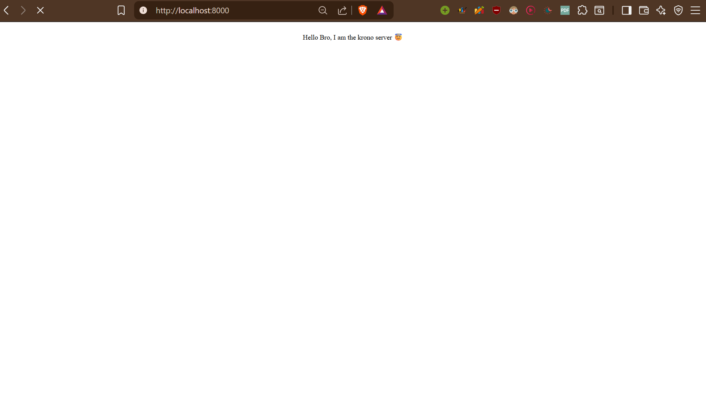

# krono

A small web server written in C to learn low-level networking, sockets, and HTTP by building the pieces manually.

## Overview

`krono` is a Windows-first experiment in socket programming using `Winsock2`. The project currently accepts TCP connections, reads HTTP requests, and serves static files from the `root/` directory.

## Current Features

- **Winsock2-based server** for Windows
- **TCP socket lifecycle**: startup, socket creation, bind, listen, and accept
- **Basic HTTP response handling**
- **Static file serving** from the `root/` directory
- **Simple MIME type detection** for common web assets
- **Makefile build** that links against `ws2_32`
- **Cache module scaffolding** for future optimization work

## Project Structure

```text
.
├── krono.c        # main server
├── file.c/.h      # file loading helpers
├── mime.c         # MIME type lookup
├── cache.c/.h     # cache-related work in progress
├── root/          # static files served by the server
└── Makefile       # build automation
```

## Prerequisites

- Windows
- A C compiler such as GCC/MinGW
- `make`

## Build

Using the included `Makefile`:

```bash
make
```

This builds:

```bash
krono.exe
```

Equivalent manual command:

```bash
gcc -Wall -Wextra -std=c11 krono.c -o krono.exe -lws2_32
```

## Run

```bash
./krono.exe
```

The server listens on:

```text
http://localhost:8000
```

## Serving Files

Static files are served from the `root/` directory.

For example, with `root/index.html` present, open:

```text
http://localhost:8000/index.html
```

## Progress

Implemented so far:

- [x] Winsock initialization
- [x] TCP socket creation
- [x] Binding to a local address and port
- [x] Listening for incoming connections
- [x] Accepting client connections
- [x] Receiving HTTP requests
- [x] Sending HTTP responses
- [x] Loading files from disk
- [x] Basic MIME type detection
- [x] Makefile-based build with `ws2_32`
- [ ] Stable cache implementation
- [ ] Multi-client or threaded handling

## Notes

This project is still experimental and focused on learning. Some parts of the codebase, especially caching and HTTP handling, are still being improved.

## License

This project is for educational purposes.
